<h1 align="center">hi, i'm martim 👋</h1>

  

  🌐 <a href="https://martimfasantos.github.io/">my portfolio</a> · 📝 <a href="https://github.com/martimfasantos/MSc-Thesis">msc thesis</a>

  &nbsp;
  &nbsp;
  

 

### 🛠️ languages & tools

---

### 👨🏻‍💻 some of my open source contributions

  
  
  
  
  
  
  
  
  

---

### 📊 github stats

  
  

<picture>
  <source media="(prefers-color-scheme: dark)" srcset="https://raw.githubusercontent.com/martimfasantos/martimfasantos/output/github-snake-dark.svg"/>
  <source media="(prefers-color-scheme: light)" srcset="https://raw.githubusercontent.com/martimfasantos/martimfasantos/output/github-snake.svg"/>
  
</picture>
